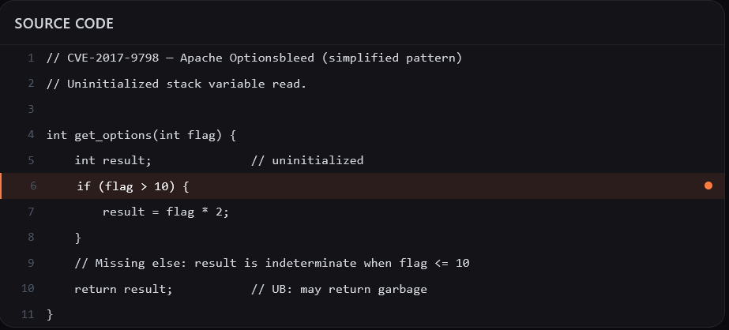
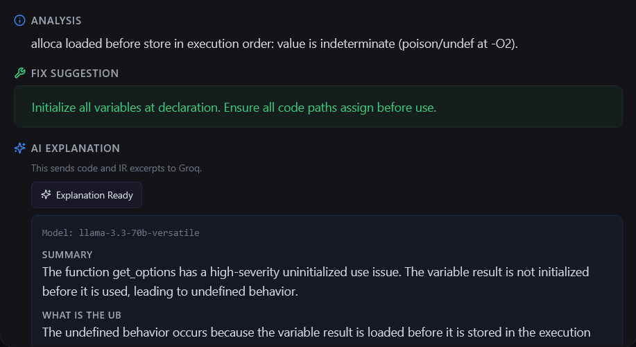
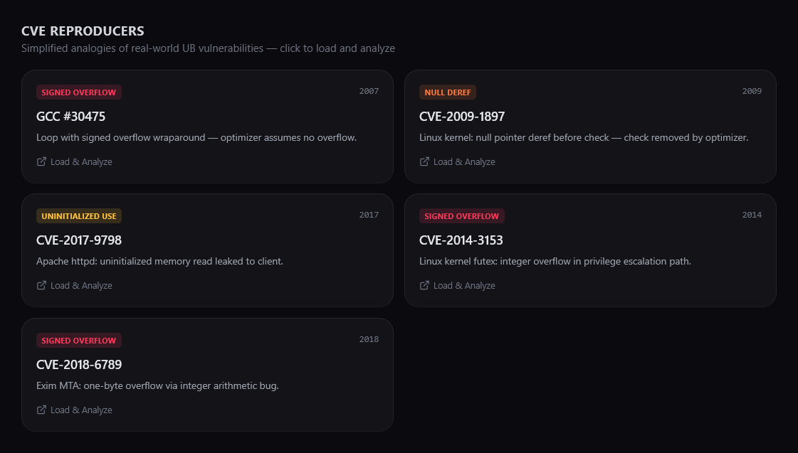

# UB Time Bomb Detector

A static analysis tool that detects **undefined behavior (UB) time bombs** in C/C++ code by comparing LLVM IR generated at `-O0` vs `-O2`. When the optimizer exploits UB assumptions to eliminate branches, remove null checks, or fold computations, this tool catches it — before it blows up in production.

---

## Demo / Screenshots

### Full Application


### Source Code Example



### LLVM IR Diff View


### AI-Powered Analysis



### CVE Reproducer Test Cases



### Failure Case — Out-of-Bounds Buffer Access (Not Detected)

This is UB (writing past array bounds) but the tool correctly does not flag it — buffer overflow is outside the tool's 4 UB categories. The optimizer does not exploit this at the IR level, so no O0/O2 diff is produced.


---

## How It Works

```
Source Code (.c)
     │
     ├──▶ clang -O0 -g -fno-inline -emit-llvm -S  →  Unoptimized IR
     │
     └──▶ clang -O2 -g -fno-inline -emit-llvm -S  →  Optimized IR
                    │
                    ▼
          ┌─────────────────────┐
          │  Behavioral Change  │  Compare per-function IR:
          │     Detector        │  blocks, branches, flags
          └────────┬────────────┘
                   │
                   ▼
          ┌─────────────────────┐
          │   UB Pattern        │  Classify into:
          │   Classifier        │  overflow, null deref, aliasing, uninit
          └────────┬────────────┘
                   │
                   ▼
          ┌─────────────────────┐
          │  Report Generator   │  JSON + text reports with
          │                     │  source locations & fix suggestions
          └─────────────────────┘
```

**Key insight:** If the optimizer changes the behavior of your function (removes branches, eliminates checks), it's exploiting an assumption that your code has no UB. If that assumption is wrong, you have a **time bomb** — code that works today but breaks with the next compiler upgrade.

---

## UB Categories Detected

| Category | Severity | Detection Method |
|---|---|---|
| **Signed Integer Overflow** | Critical | `nsw` flag + branch elimination, or signed add/compare folded to constant |
| **Null Pointer Dereference** | Critical | Null check present at O0, removed at O2 |
| **Strict Aliasing Violation** | High | Type-punned store/load with load eliminated at O2 |
| **Uninitialized Variable Use** | High | `alloca` without store + `undef` exposure at O2 |

---

## Quick Start

### Prerequisites

- **Python 3.10+**
- **Clang/LLVM 14+** (tested with Clang 22)

```powershell
# Verify clang is installed
clang --version

# If not installed (Windows):
winget install LLVM.LLVM
```

### Build (Install Dependencies)

**Windows (PowerShell):**
```powershell
.\build.ps1
```

**Linux/macOS/WSL:**
```bash
chmod +x build.sh run.sh
./build.sh
```

This creates a `venv/` virtual environment and installs all dependencies from `requirements.txt`.

### Run the Evaluation Suite

**Windows (PowerShell):**
```powershell
.\run.ps1
```

**Linux/macOS/WSL:**
```bash
./run.sh
```

Expected output (all 10 test cases detected):
```
============================================================
  CORE TEST CASES
============================================================
--- test_cases/signed_overflow.c (expected: signed_overflow) ---
  Result: CAUGHT
--- test_cases/null_deref.c (expected: null_deref) ---
  Result: CAUGHT
--- test_cases/strict_aliasing.c (expected: strict_aliasing) ---
  Result: CAUGHT
--- test_cases/uninitialized.c (expected: uninitialized_use) ---
  Result: CAUGHT
--- test_cases/loop_overflow.c (expected: signed_overflow) ---
  Result: CAUGHT
  CORE TEST CASES RESULT: 5/5 detected

============================================================
  CVE REPRODUCERS
============================================================
--- eval/cve_cases/gcc_bug_30475.c (expected: signed_overflow) ---
  Result: CAUGHT
--- eval/cve_cases/cve_2009_1897.c (expected: null_deref) ---
  Result: CAUGHT
--- eval/cve_cases/cve_2017_9798.c (expected: uninitialized_use) ---
  Result: CAUGHT
--- eval/cve_cases/cve_2014_3153.c (expected: signed_overflow) ---
  Result: CAUGHT
--- eval/cve_cases/cve_2018_6789.c (expected: signed_overflow) ---
  Result: CAUGHT
  CVE REPRODUCERS RESULT: 5/5 detected

============================================================
  OVERALL SUMMARY: 10/10 test cases detected
  Core: 5/5  |  CVE: 5/5
============================================================
```

### Analyze a Single File

**Windows (PowerShell):**
```powershell
.\run.ps1 test_cases\signed_overflow.c
```

**Linux/macOS/WSL:**
```bash
./run.sh test_cases/signed_overflow.c
```

### Run the Full Application (Frontend + Backend)

**Terminal 1 — Backend (API):**
```powershell
.\run.ps1 --server
```

**Terminal 2 — Frontend (UI):**
```powershell
cd frontend
npm install
npm run dev
```

Then open `http://localhost:5173` in your browser. The Vite dev server proxies `/api` requests to `http://localhost:8000`.

---

## Test Cases

### Core Test Cases (5)

| File | UB Type | What Happens |
|---|---|---|
| `signed_overflow.c` | `x + 1 > x` | O2 folds to `return 1` (always true — ignoring INT_MAX) |
| `null_deref.c` | deref before null check | O2 removes the null check as dead code |
| `strict_aliasing.c` | `float*` → `int*` punning | O2 returns stale/reinterpreted value |
| `uninitialized.c` | `int x; return x+1;` | O2 propagates `undef`/poison |
| `loop_overflow.c` | overflow guard in loop | O2 removes the `i+1 < 0` safety check |

### CVE Reproducer Test Cases (5)

| File | Bug | Category |
|---|---|---|
| `gcc_bug_30475.c` | GCC PR 30475 — signed overflow loop guard | signed_overflow |
| `cve_2009_1897.c` | Linux kernel tun/tap null deref | null_deref |
| `cve_2017_9798.c` | Apache Optionsbleed — uninitialized memory | uninitialized_use |
| `cve_2014_3153.c` | Linux futex syscall integer overflow | signed_overflow |
| `cve_2018_6789.c` | Exim base64 decode overflow | signed_overflow |

### Known Scope Limitation

The tool targets 4 specific UB categories that the optimizer exploits to produce measurable IR diffs. Other forms of UB (e.g., buffer overflow, use-after-free, division by zero) are **outside scope** — the optimizer does not produce an O0/O2 IR diff for these, so the tool correctly returns 0 findings.

---

## API Reference

### `GET /health`
Returns `{"status": "ok"}`.

### `POST /analyze`
Analyze C source code from request body.

**Request:**
```json
{
  "source_code": "int f(int x) { return x + 1 > x; }",
  "filename": "test.c"
}
```

### `POST /analyze-file`
Analyze an existing `.c` file by path.

**Request:**
```json
{"file_path": "test_cases/signed_overflow.c"}
```

### `POST /ai-explain`
Generate an AI explanation for a single selected finding.

**Request:**
```json
{
  "finding": {
    "function": "f",
    "category": "signed_overflow",
    "severity": "critical",
    ...
  }
}
```

---

## Enable AI Explanations (Groq)

Set these environment variables before starting the backend:

- `GROQ_API_KEY` (required)
- `GROQ_MODEL` (optional, default: `llama-3.3-70b-versatile`)
- `GROQ_FALLBACK_MODEL` (optional, default: `llama-3.1-8b-instant`)

If `GROQ_API_KEY` is not set, the app still runs normally and the AI button is disabled.

Privacy note: Generating AI explanations sends selected finding data, source snippet excerpts, and IR diff excerpts to Groq.

---

## Project Structure

```
UB-Timebomb-Detector/
├── README.md                    ← This file (what + how to run)
├── DESIGN.md                    ← Approach + alternatives
├── IMPLEMENTATION.md            ← LLVM IR details
├── EVALUATION.md                ← Metrics + comparison + test cases
│
├── build.sh / build.ps1        ← Build scripts (install deps)
├── run.sh / run.ps1            ← Run scripts (eval / analyze / server)
│
├── screenshots/                 ← Demo screenshots
│
├── requirements.txt
│
├── backend/
│   ├── main.py                  ← FastAPI server
│   ├── core/
│   │   ├── compile_engine.py    ← Differential compilation (O0 vs O2)
│   │   ├── change_detector.py   ← IR structural diff analysis
│   │   ├── ub_classifier.py     ← UB pattern classification
│   │   ├── report_generator.py  ← JSON/text report generation
│   │   └── env_loader.py        ← .env variable loading
│   └── utils/
│       ├── ir_parser.py         ← LLVM IR parsing & pattern matching
│       └── demangle.py          ← C++ name demangling
│
├── test_cases/                  ← 5 canonical UB test files
│   ├── signed_overflow.c
│   ├── null_deref.c
│   ├── strict_aliasing.c
│   ├── uninitialized.c
│   └── loop_overflow.c
│
├── eval/
│   ├── run_evaluation.py        ← Batch test runner
│   ├── evaluation_results.json  ← Latest results
│   └── cve_cases/               ← 5 CVE reproducer test cases
│
└── frontend/                    ← React + Vite UI
    ├── src/
    └── package.json
```

---

## Tech Stack

| Layer | Technology |
|---|---|
| Backend | Python 3.10+, FastAPI, uvicorn |
| Frontend | React 18, Vite, Tailwind CSS, Monaco Editor, Recharts |
| Compiler | Clang/LLVM (14+ tested through 22) |
| IR Parsing | Python regex (no llvmlite dependency) |
| AI | Groq API (Llama 3.3 70B) |
| Testing | pytest, custom evaluation harness |
